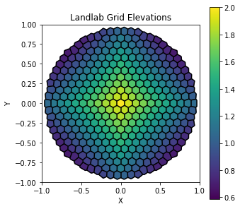

dmsh to landlab: example 1
==========================

In this example we use the `dmsh <https://github.com/nschloe/dmsh>`__
package to create a mesh that is then passed in to initialize a
`landlab <https://github.com/landlab/landlab>`__ grid. In this example
we will do the following:

1. Generate a circular mesh with *dmsh*
2. Optionally optimize it with
   `optimesh <https://github.com/nschloe/optimesh>`__
3. Translate the mesh to *landlab*
4. Assign elevation values to the *landlab* mesh
5. Run the *landlab* flow accumulation routine

Import libraries
~~~~~~~~~~~~~~~~

This notebook requires the packages *dmsh*, *landlab*, *numpy* and
*matplotlib*. These are all packages that can be **pip**-installed.

.. code:: ipython3

    import dmsh
    from landlab.plot.imshow import imshow_grid
    from landlab.plot.graph import plot_graph
    from landlab.grid import VoronoiDelaunayGrid
    from landlab.components import FlowAccumulator
    from landlab.components import FlowDirectorSteepest
    import numpy as np
    import matplotlib.pyplot as plt

Generate mesh (and optimize it)
~~~~~~~~~~~~~~~~~~~~~~~~~~~~~~~

We start by constructing a circular mesh in *dmsh*. The syntax for this
is ``geo = dmsh.Circle([Center X-Coord, Center Y-Coord], Diameter)`` and
then ``dmsh.generate(geo, edge_length)``.

After defining the mesh with *dmsh*, we (optionally) optimize it with
*optimesh*.

.. code:: ipython3

    geo = dmsh.Circle([0.0, 0.0], 1.0)
    X, cells = dmsh.generate(geo, 0.09)
    
    # try to optimize the mesh using optimesh
    try:
        import optimesh
        X, cells = optimesh.cvt.quasi_newton_uniform_full(X, cells, 1.0e-10, 100)
    except:
        print('optimesh not installed, mesh is not optimized.')

Visualize the mesh
~~~~~~~~~~~~~~~~~~

We use a built-in *dmsh* function to take a look at what the mesh we’ve
defined actually looks like.

.. code:: ipython3

    dmsh.helpers.show(X, cells, geo)

.. image:: output_6_0.png

Translate the mesh to landlab
~~~~~~~~~~~~~~~~~~~~~~~~~~~~~

Now we define a *landlab* Voronoi Delaunay unstructured grid using the
(x,y) coordinates of the points defined in the *dmsh* grid (stored in
the variable ``X``).

.. code:: ipython3

    vmg = VoronoiDelaunayGrid(X[:,0], X[:,1])

Visualize the landlab mesh
~~~~~~~~~~~~~~~~~~~~~~~~~~

To see how this translation went, we can use one of the built-in
*landlab* functions to visualize the *landlab* mesh.

.. code:: ipython3

    plt.figure(figsize=(4, 4))
    plot_graph(vmg, at="link", with_id=False)

Set landlab grid elevations
~~~~~~~~~~~~~~~~~~~~~~~~~~~

Next we will demonstrate now elevation data can be added to this grid.

First we initialize the grid with 0s as elevation values. Then we define
all values left of the origin as -1, and those to the right of the
origin as 1.

.. code:: ipython3

    z_vals = vmg.add_zeros("topographic__elevation", at="node")

.. code:: ipython3

    for i in range(np.shape(X)[0]):
        if X[i,0] < 0:
            vmg.at_node['topographic__elevation'][i] = -1
        else:
            vmg.at_node['topographic__elevation'][i] = 1

Visualize the elevations of the mesh
~~~~~~~~~~~~~~~~~~~~~~~~~~~~~~~~~~~~

Now that we have assigned elevations to the *landlab* grid, we can
visualize the elevations with another one of the built-in *landlab*
functions. We expect to see a vertical divide at ``x=0`` separating the
-1 elevations on the left and +1 elevations on the right.

.. code:: ipython3

    plt.figure(figsize=(5,5))
    plt.title('Landlab Grid Elevations')
    imshow_grid(vmg, 'topographic__elevation', show_elements=True, cmap='viridis')

.. parsed-literal::

    /home/jayh/miniconda3/envs/espin/lib/python3.8/site-packages/landlab/plot/imshow.py:267: MatplotlibDeprecationWarning: You are modifying the state of a globally registered colormap. In future versions, you will not be able to modify a registered colormap in-place. To remove this warning, you can make a copy of the colormap first. cmap = copy.copy(mpl.cm.get_cmap("viridis"))
      cmap.set_bad(color=color_for_closed)

.. image:: output_15_1.png

Set grid elevations as function of *x*
~~~~~~~~~~~~~~~~~~~~~~~~~~~~~~~~~~~~~~

That last example of elevation assignment was rather trivial. Let’s take
a look at how we might assign elevations based on a function ``f(x)``.
To do this we will first create a function of the form
``f(x) = 1 - |x|`` and then we will assign elevation values to the grid
nodes based on this function.

.. code:: ipython3

    def f_elev(x):
        elev = 1 - np.abs(x)
        return elev

.. code:: ipython3

    for i in range(np.shape(X)[0]):
        vmg.at_node['topographic__elevation'][i] = f_elev(X[i,0])

Visualize the elevations of the mesh
~~~~~~~~~~~~~~~~~~~~~~~~~~~~~~~~~~~~

Again we can use the ``imshow_grid()`` functionality in *landlab* to
visualize this mesh.

.. code:: ipython3

    plt.figure(figsize=(5,5))
    plt.title('Landlab Grid Elevations')
    imshow_grid(vmg, 'topographic__elevation', show_elements=True, cmap='viridis')

.. image:: output_20_0.png

Run landlab flow accumulator and visualize it
~~~~~~~~~~~~~~~~~~~~~~~~~~~~~~~~~~~~~~~~~~~~~

Now we’ll use the ``FlowAccumulator`` component of *landlab* to
visualize the drainage network on this grid. We expect there to be an
accumulation of flow at the left and right boundaries where we have low
topography, and no flow accumulation at ``x=0`` where we have our high
elevations.

.. code:: ipython3

    fa = FlowAccumulator(vmg, 'topographic__elevation',
                         flow_director=FlowDirectorSteepest)

.. code:: ipython3

    fa.run_one_step()

.. code:: ipython3

    imshow_grid(vmg, 'drainage_area', show_elements=False, cmap='viridis')

Set grid elevations as function of both *x* and *y*
~~~~~~~~~~~~~~~~~~~~~~~~~~~~~~~~~~~~~~~~~~~~~~~~~~~

Here we create a function ``f(x,y)`` to describe the elevation as a
function of both the ``x`` and ``y`` position in space. This example is
quite similar to the previous one, here we just add a ``y`` component to
the function.

.. code:: ipython3

    def f_elev(x, y):
        elev = 2 - np.abs(x) - np.abs(y)
        return elev

.. code:: ipython3

    for i in range(np.shape(X)[0]):
        vmg.at_node['topographic__elevation'][i] = f_elev(X[i,0], X[i,1])

Visualize the elevations of the mesh
~~~~~~~~~~~~~~~~~~~~~~~~~~~~~~~~~~~~

Again we’ll use the built-in ``imshow_grid()`` function to look at the
elevations of the mesh.

.. code:: ipython3

    plt.figure(figsize=(5,5))
    plt.title('Landlab Grid Elevations')
    imshow_grid(vmg, 'topographic__elevation', show_elements=True, cmap='viridis')

Run landlab flow accumulator and visualize it
~~~~~~~~~~~~~~~~~~~~~~~~~~~~~~~~~~~~~~~~~~~~~

Now if we run the ``FlowAccumulator`` we expect to see an accumulation
of flow in the upper left, upper right, lower left, and lower right
sections of the grid.

.. code:: ipython3

    fa = FlowAccumulator(vmg, 'topographic__elevation',
                         flow_director=FlowDirectorSteepest)

.. code:: ipython3

    fa.run_one_step()

.. code:: ipython3

    imshow_grid(vmg, 'drainage_area', show_elements=False, cmap='viridis')

End
~~~

Congrats! You’ve successfully generated a mesh in *dmsh* and imported it
into *landlab*.
